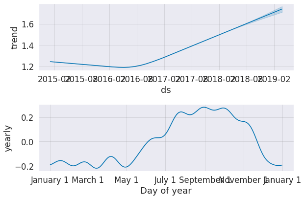

# Future-Product-Prices-Prediction

Meta Prophet is an open-source forecasting tool. It is designed to handle time series data and produce high-quality forecasts with minimal manual effort. Prophet is particularly useful for business applications such as predicting product prices, sales, and other key metrics.

Dataset - Predicting avacadoes future price.

